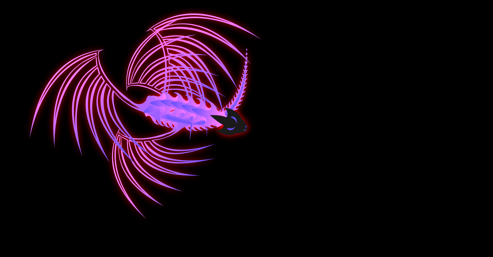

# 🐉 Dragon Cursor Effect (HTML, CSS & JavaScript)

An interactive and visually stunning **Dragon Cursor Animation UI** built using **HTML, CSS, SVG, and Vanilla JavaScript**.

This project creates a glowing, animated **dragon that smoothly follows the user's cursor**, simulating natural motion using mathematical calculations and chained segment animation.

---

## 🧱 Project Structure

```bash
dragon-cursor-effect/
│
├── index.html        # SVG structure and layout
├── styles.css        # Styling and visual effects
├── main.js           # Animation and cursor tracking logic
├── LICENSE           # MIT LICENSE
└── README.md         # Project documentation
```

---

## ✨ Features

### 🐉 Cursor-Following Dragon

* Dragon head tracks the cursor position
* Body follows with smooth trailing motion
* Creates a **snake-like / fluid animation effect**

### 🔗 Chain-Based Animation

* Built using multiple connected segments
* Each segment follows the previous one
* Uses **trigonometry (atan2, sin, cos)** for realistic movement

### 🌈 Dynamic Visual Effects

* Glowing neon-style dragon using `drop-shadow`
* Continuous **color shifting (hue-rotate)**
* Smooth animation rendering with `requestAnimationFrame`

### 🎯 Interactive Experience

* Responds instantly to cursor movement
* Idle animation when cursor is still
* Feels alive and reactive

---

## 🛠 Technologies Used

| Technology               | Role                             |
| ------------------------ | -------------------------------- |
| **HTML5**                | Structure and SVG container      |
| **CSS3**                 | Styling and glow effects         |
| **SVG**                  | Dragon shapes and reusable parts |
| **JavaScript (Vanilla)** | Animation logic and interaction  |

---

## 🧠 Core Concepts Used

* Pointer tracking (`pointermove`)
* Trigonometric motion (`Math.atan2`, `sin`, `cos`)
* Chain physics simulation
* DOM manipulation using SVG `<use>`
* Real-time animation loop (`requestAnimationFrame`)

---

## ▶️ How to Run

### 1️⃣ Clone the Repository

```bash
git clone https://github.com/ShakalBhau0001/dragon-cursor-effect.git
cd dragon-cursor-effect
```

### 2️⃣ Open the Project

Simply open:

```bash
index.html
```

in any modern browser.

---

## ⚠️ Limitations

* No mobile optimization
* High animation load on low-end devices
* No customization UI for speed, size, or colors

---

## 🚀 Future Improvements

* Add **fire trail / particle effects**
* Add **click interaction (dragon attack / burst)**
* Improve **mobile responsiveness**
* Add **settings panel (speed, size, colors)**
* Convert into a **reusable JS library**

---

## 🎯 Purpose of This Project

This project is built to:

* Practice **advanced JavaScript animation**
* Understand **SVG manipulation**
* Learn **mathematical motion in UI**
* Build **creative frontend experiences**
* Enhance **portfolio-level projects**

---

## 📸 Preview



---

## 🪪 Author

> **Creator: Shakal Bhau**

> **GitHub: [ShakalBhau0001](https://github.com/ShakalBhau0001)**

---

## ⭐ Support

If you like this project, consider giving it a ⭐ on GitHub!

---
